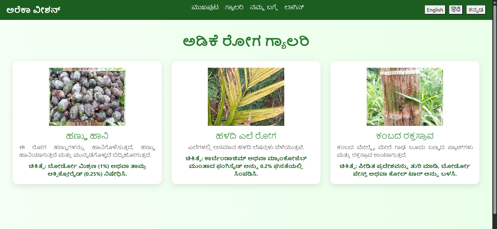
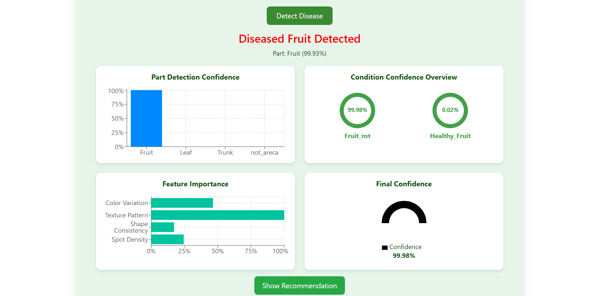
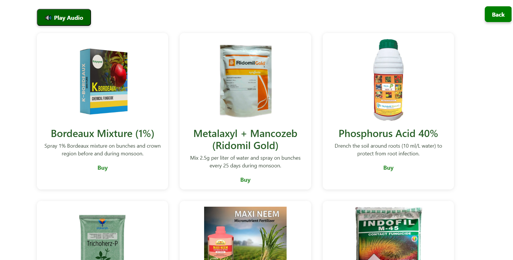

## Areca_Health_Vision - A Smart System for Arecanut Crop Disease Detection


**Areca_Health_Vision** is an AI-based web application designed to detect multiple diseases in **arecanut plants** at various growth stages. It helps farmers and researchers identify diseases early, recommends suitable pesticides or insecticides, and visualizes model decisions using Explainable AI techniques.

---

## Project Overview

Arecanut (Areca catechu) is a major commercial crop affected by several diseases such as fruit rot, yellow leaf, and stem bleeding. Manual identification of these diseases is time-consuming and prone to error.  

**Areca_Health_Vision** leverages **deep learning** and **image processing** techniques to automatically detect diseases from uploaded images of arecanut plant parts — **fruit, leaf, or trunk** — and provides confidence levels for both part classification and disease prediction.  

It consists of two major detection steps:
1. **Part Identification:** Detects whether the uploaded image belongs to the arecanut plant and identifies its part (fruit, leaf, trunk, or not_areca).  
2. **Disease Classification:** Based on the identified part, the model classifies the image as *healthy* or *diseased* and specifies the disease type and prediction confidence.


---

## Key Features

-  **Automated disease detection** for multiple arecanut plant parts  
-  **Dual-stage model pipeline:** part classification + disease classification   
-  **Web-based interface** for real-time image uploads and instant results  
-  **Confidence-based outputs** and disease risk percentage  
-  **Recommendation system** suggesting appropriate pesticides/insecticides  

---

## 🖥️ Technologies Used

### 🔹 Frontend
- React.js  

### 🔹 Backend
- Node.js
- Flask  

### 🔹 Machine Learning
- DEIT-III transformer

### 🔹 Database
- MySQL 

### 🔹 Tools & Environment
- VS Code  
- Postman  
- Github
- Ardiuno IDE 

---

## Screenshots

### 1. Home Page


### 2. Disease Detection Result


### 3. Recommendation module


---

## System Architecture

```text
User → Web UI (React)
      ↓
Backend API (Node.js)
      ↓
ML Model (Python - Flask)
      ↓
Database (MySQL)


